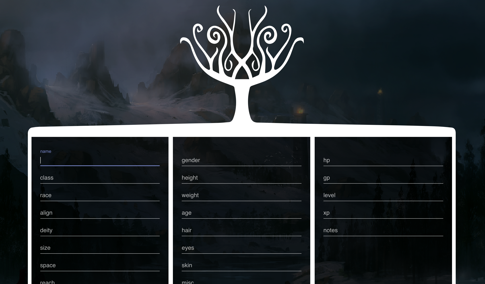

# White Tree

## Getting started

* Be sure to have `node` installed (version 8 or 9 is recommended)
* Be sure to have `yarn` installed (yarnpkg.com)
* Clone this repo
* Run `yarn install` to install all dependencies from `package.json`
* Run `yarn start` to start the development environment
* You should be good to go, the site will load on `localhost:3000` by default

## Libraries

Below are some libraries and best-practices I'd recommend looking into when building an app with React. (A majority of these have already been included in this project)

* [create-react-app](https://github.com/facebook/create-react-app)–
  Create React apps with no build configuration.
* [eslint](https://github.com/eslint/eslint)– JavaScript linting utility
* [prettier](https://github.com/prettier/prettier)– Opinionated code formatting for js/json/css/md
* [material-ui-next](https://material-ui-next.com/)– Components! Styling! More info below.
* [formik](https://github.com/jaredpalmer/formik)– Form state management and utilities
* [yup](https://github.com/jquense/yup)– Client-side form schema validation

## Components + Styling with Material-UI-Next + CSS-in-JS

We'll use CSS-in-JS to help guarantee that our components have all their markup, logic, and styling, together. CSS-in-JS helps prevent against any side effects that could occur from the cascading portion of CSS, while also giving us the ability to theme and customize our components with ease.

* [Benefits of using JavaScript Style Sheets](http://cssinjs.org/benefits)
* [React: CSS in JS by vjeux (2014)](https://speakerdeck.com/vjeux/react-css-in-js)

The component library I have included in the project is Material-UI: specifically the @next version of the project (v1.0). It's currently in beta but should be released in the near future (and it's plenty stable– I am using it in production elsewhere)

All the documentation for using their components is available at https://material-ui-next.com/

## Forms with Formik

The majority of functionality in applications revolve around _forms_. In order to maintain organization and consistency– we'll want to use the library Formik.

> "My goal with Formik was to create a scalable, performant, form helper with a minimal API that does the really really annoying stuff, and leaves the rest up to you." –[Jared Palmer at ReactNYC](https://www.youtube.com/watch?v=-tDy7ds0dag&feature=youtu.be&t=33s)

Formik can help ensure you've accounted for the following:

* Proper input types for requested data
* Validation messaging at the form level
* Validation messaging at the individual field level
* Loading and disabled states for async data fetching and on submit
